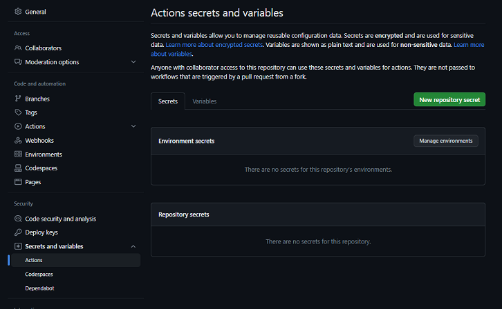

# unregexle
Solves the Regexle game (https://regexle.com) in no time

## Usage
1. Run `setup.py`.
1. To solve the ongoing Regexle(s), run `main.py` as is since the whole process is automated.
    - Use `python main.py <size>` depending on what Squaredle mode you'd like to play.
    - If the mode is not given, it will default to the normal daily Regexle (`size=3`).

## How it works

In a nutshell, backtracking with pruning.

## Telebot integration

It's amazing how this can be wrapped in a Telegram bot. You have two options:
1. Create `env.py` and put `TOKEN` and `CHATS` as the bot token and the comma-separated chat IDs, respectively. For example:

    ```py
    TOKEN = 'abcDEF123789'
    CHATS = '123456,-987654,42069'
    ```

1. Use GitHub repository secrets and put `TOKEN` and `CHATS` accordingly without the quotation marks. See the image below.



## Contributing

asdf